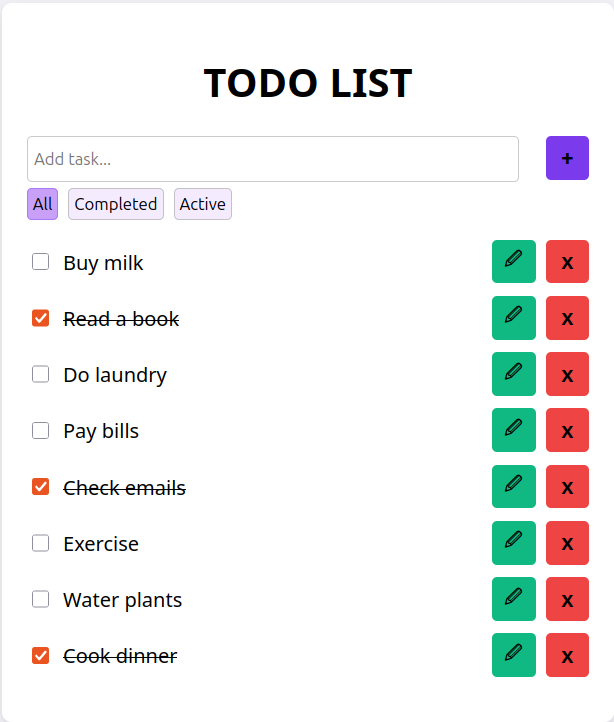

# Todo App

A simple React Todo List application to manage daily tasks. This app allows users to add, edit, delete, complete, and filter tasks, with data persisted in localStorage.



---

## Features

- **Add Tasks** – Add new tasks to list.
- **Edit Tasks** – Update task.
- **Delete Tasks** – Remove tasks from the list.
- **Mark Complete** – Click on a task to toggle completion.
- **Filter Tasks** – View all tasks, completed tasks, or active tasks.
- **Persistent Storage** – Tasks are saved in localStorage and persist across page reloads.

--- 

## Getting Started

**1. Clone the repository:**
```bash
git clone <repo-url>
```
**2. Navigate into the project folder:**
```bash
cd todo-app
```
**3. Install dependencies:**
```bash
npm install
```
**4. Start development server:**
```bash
npm start
```
or
```bash
npm run dev
```
